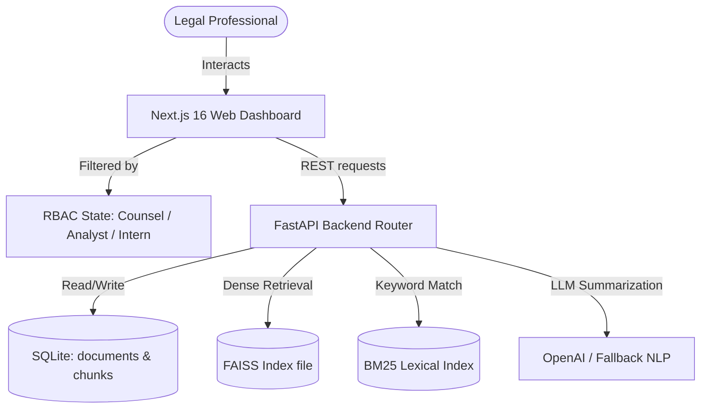

# Legal Contract Copilot — Auditable Enterprise RAG Platform

An auditable enterprise document intelligence platform for legal contract analysis.

---


## 🛠️ System Architecture



---

## ⚡ Key SaaS & Enterprise Features

### 1. Pluggable Dual-Strategy RAG Engine (Local & Cloud)
To demonstrate architectural maturity, the retrieval and reranking pipelines are built on a pluggable provider design:
*   **On-Premises / Local Strategy**: Uses dynamic lazy imports to load `sentence-transformers` (`all-MiniLM-L6-v2`) and local `CrossEncoder` (`ms-marco-MiniLM-L-6-v2`) running directly on a local PyTorch runtime. (Ideal for high-security, air-gapped deployments).
*   **Serverless / Cloud-Hosted Strategy**: Uses OpenAI (`text-embedding-3-small` and a `gpt-4o-mini` LLM-based reranking prompt).
*   **Infrastructure-Aware Auto-Detection**: The codebase dynamically checks package availability at runtime. If PyTorch or local models are missing (e.g. to fit under Render's memory-constrained **512MB RAM free tier**), the server gracefully falls back to cloud API services without crashing.

### 2. Auditable AI (Trust-First UI)
General RAG platforms suffer from hallucinations that are costly in legal environments. Legal Contract Copilot features an interactive **Legal Document Reader** panel. Clicking any citation in the chat panel automatically navigates the reader to the source page and scrolls to highlight the exact cited paragraph with a glowing highlight.

### 3. Hybrid RAG (Dense + Lexical Search via RRF)
To prevent missing exact section numbers, dates, or contract terms, the retrieval pipeline combines:
*   **Dense Semantic Search**: Using semantic vector matches via a local FAISS index.
*   **Lexical Keyword Search**: Using BM25 token-matching.
*   **Reciprocal Rank Fusion (RRF)**: Merges dense and lexical matches to output top results.
*   **Cross-Encoder Reranking Toggle**: Allows toggling reranking in the chat settings to compare latency and precision changes live.

### 4. Role-Based Access Control (RBAC)
Demonstrates enterprise-grade data security with a role switcher in the header:
*   **Legal Counsel (Admin)**: Full permissions (ingestion, comparison, deletion).
*   **Contract Analyst (Editor)**: Allowed to query and compare agreements.
*   **Intern (Viewer)**: Read-only access (Ingestion panels and cloud imports are dynamically locked with tooltip alerts).

### 5. Enterprise Cloud Connectors
Includes simulated Google Drive and SharePoint cloud directories. Users can view, sync, and ingest external documents (NDA, SLA, Employment contracts) directly into the SQL and vector indexes with a simulated real-time progress flow.

### 6. Multi-Document Comparison Matrix
A side-by-side analysis panel that extracts, evaluates, and compares clauses (Termination notice, Liability caps, Governing Law, and Purpose) across two ingested agreements, highlighting variance risks.

---

## 💻 Tech Stack

*   **Frontend**: Next.js 16 (Turbopack), React 19, TypeScript, Tailwind CSS, Framer Motion, Lucide Icons.
*   **Backend**: FastAPI, Python 3.12, SQLite, Uvicorn.
*   **GenAI/ML**: Sentence Transformers (`all-MiniLM-L6-v2` & `ms-marco-MiniLM-L-6-v2`), FAISS, Rank-BM25, OpenAI API.

---

## ⚙️ Local Setup Instructions

### 1. Backend Setup
Navigate to the `backend` directory, initialize the virtual environment, and install dependencies:
```bash
cd backend
python3 -m venv venv
source venv/bin/activate
pip install -r requirements.txt
```

Create a `.env` file in the `backend` folder and add your OpenAI API Key:
```env
OPENAI_API_KEY=your_api_key_here
```

Start the FastAPI application with reload enabled:
```bash
uvicorn app.main:app --reload --port 8000
```
*Note: SQLite database (`rag.db`) and FAISS indexes will be initialized automatically in `backend/data/`.*

### 2. Frontend Setup
Navigate to the `frontend` directory and install packages:
```bash
cd ../frontend
npm install
```

Start the Next.js development server:
```bash
npm run dev
```
The application will run on **[http://localhost:3000](http://localhost:3000)** (or **[http://localhost:3001](http://localhost:3001)** if port 3000 is occupied).
